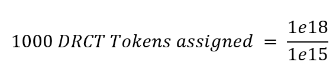
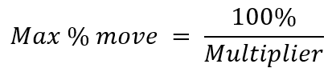

<p align="center">
  <a href='https://www.daxia.us/'>
    
  </a>
</p>

<p align="center">
  <a href='https://dapp.daxia.us/'>
    
  </a>
  <a href='https://deriveth.slack.com/'>
    
  </a>
  <a href='https://t.me/daxiachat'>
    
  </a>
  <a href='https://twitter.com/DaxiaOfficial'>
    
  </a> 
   
</p>


## Table of Contents

* Dynamic Rate Cash Transaction Tokens
  * [Overview](#overview)
  * [Motivation](#background)
  * [How Does it work?](#how-it-works)
  * [Standarized variables](#standarized-variables)
  * [Information necessary to trade](#info-for-trading)
  * [Risk Profiles](#risk-profiles)
  * [Example Usage Scenarios](#usage-scenarios)
  * [Conclusion](#Conclusion)

* [Useful Links](#UsefulLinks)

<details><summary>Contributing information</summary>

   * [Maintainers](#Maintainers)
   * [How to Contribute](#how2contribute)
   * [Copyright](#copyright)
 </details>

# Dynamic Rate Cash Transaction Tokens

## Overview <a name="overview"> </a> 
Dynamic Rate Cash Transaction (DRCT) Tokens are standardized contracts for trading risk and hedging exposure to underlying reference rates. DRCT token contracts are a risk management tool for cryptocurrency users that allow to long and/or short cryptocurrencies. Being long is a position where, if the price goes up, you make money and if it goes down, you lose money. The traditional way of being long an asset would be to simply own it. Being short is a position where if the price goes down you make money and if it goes up you lose money. If you own an asset and short it, your held asset loses value but your short position makes you money, helping you mitigate the price volatility risk. 

DRCT contracts can provide more flexibility in terms of rate sensitivity and trading mechanisms than traditional OTC derivatives and allow for custom hedging and trading strategies not provided by traditional investments in cryptocurrency without minimum thresholds and with no intermediaries.

Additionally, DRCT tokens allow users to long or short assets that are non-native to Ethereum (like Bitcoin, Monero, Stellar, etc...) with Ether or any other ERC20 token.  

<p align="center">

</p>

DRCT contracts start with a "creator" and are given a rate/duration/start date combination. Ether is locked as collateral in the smart contract by the creator.  Short and Long Tokens are issued to the creator and represent the payouts of the contract. These tokens can be posted for sale on the Daxia Bulletin or with partner exchanges. On the end date of the contract, the tokens are paid out from the collateral (to whoever is holding them at that point in time) based on the change in the underlying rate. 

All DRCT tokens ascribe to ERC20 specifications and can trade on any centralized or decentralized exchange. 

## Background <a name="background"> </a> 
True adoption of cryptocurrencies will only occur when price volatility can be harnessed. Derivatives are products that say I’ll give you X in the future based on the change in Y. They can allow users to device risk mitigation strategies for highly volatile assets.

A functioning risk transfer market is the backbone of an advanced market economy. Whether it’s businesses needing to hedge currency risk or parties seeking exposure to a certain asset, a derivatives market is imperative for longer term planning and risk mitigation for a financial system. 

DRCT contracts provide a decentralized option for derivatives that bear no counterparty risk (fully collateralized), are not exchange specific (it produces ERC20 compliant tokens that can be traded on a centralized or decentralized exchange) and bring efficiency to the traditional system. Currently, if two parties want to hedge or transfer risk, that seemingly simple transaction looks like this:

<p align="center">

</p>


The DRCT contracts allow for this new and more efficient model:

<p align="center">

</p>

### How Does it work? <a name="how-it-works"> </a> 

If you wish to simply enter a contract without a deep dive into the underlying solidity, you can use our DApp at http://dapp.daxia.org/ and follow the instructions in the "How To" section (metamask is required).

Let's dive in:

DRCT contracts allow for a swap of two tokens based on the change in an underlying reference rate, technically forward contracts. By using token abstraction techniques from protocols such as 0x, the underlying tokens can trade as pure leveraged directional tokens.

But before users can create DRCT contracts, the operator, Daxia, has to deploy the factory dud. The factory dud is deployed once and subsequent factories are cloned from it to minimize costs (for more information on cloning contracts see our article <a href= https://blog.goodaudience.com/attack-of-the-clones-how-dda-contracts-are-so-cheap-to-deploy-f3cee9c7566>Attack Of The Clones — How DDA Contracts Are So Cheap To Deploy</a>). Once the factory dud is deployed the operator can deploy a factory and set the standardized variables (token ratio, time duration in days, and multiplier) for the factory. The factory contract is the base of the system.  It holds the standardized variables and is called to create new contracts and create new DRCT tokens for the users. The source for the underlying reference rate is also specified at the factory level and all contracts and tokens created from it will be tied to that source. 

Ethereum smart contracts cannot access off-chain data. If a smart contract relies on off-chain (e.g. internet) data to evaluate or execute a function, as the DRCT contracts do, the operator either has to manually feed the data to the contract, incentivize users to do it, or rely on a centralized party to provide the data (Oraclize.it is generally the standard). Currently, DRCT contracts use Oraclize.it to get off-chain data. The operator will have to deploy an oracle specifying the source and set the oracle address for the factory. Daxia specifies two API's for Oraclize.it to get reference rate data from, Gdax and Binance. If the Gdax API is unavailable/fails, the oracle will alternate between Gdax and Binance every 60 minutes until the underlying reference rate is obtained. We recognize the risk of the oracle or API's failing and we are mitigating that risk by having a backup API. However, Daxia is exploring other options and has developed a decentralized and more robust oracle, <a href= https://github.com/DecentralizedDerivatives/MineableOracle> Proof of Work Oracle(POWO)</a> that would be governed through a DAO. 

The Oracle contract specified APIs' are the pieces of information that allow DRCT users' to long or short assets that are non-native to Ethereum (like Bitcoin, Monero, Stellar, etc...) with Ether or any other ERC20 token. 

#### The standardized variables <a name="standarized-variables"> </a>
* Ratio -- The token ratio's simplify the number of DRCT tokens per base token. Currently our base token is designed to be ERC20 compliant. Ether has to be "wrapped" because it is not ERC20 compliant. One Ether gets you 1e18 wrapped Ether(ERC20 compliant) tokens.  To simplify this, we create a token ratio of 1e15 which means that for every one Ether worth of wrapped Ether, the party gets 1000 DRCT tokens. In the factory.setVariables function the token ratio specifies the denominator. The numerator is 1e18 since the wrapped Ether is ERC20 compliant. However, this token ratio could be customized if different ERC20 tokens are used to collateralize the short and long side.

```Solidity
factory.setVariables(1000000000000000,7,1,0); //token ratio, duration (days), multiplier, swapFee
```

<p align="center">

<br>

</p>

* Duration -- The duration is the number of days the contract lasts (from the start date onward).

* Multiplier -- The multiplier is the number by which the reference rate is multiplied by to determine the payout.  Note that this also limits the contract in terms of potential upside/downside because the contracts pay up to only the collateralized amount. A multiplier of 10 means that if the underlying rate moves by 5%, the contract pays out based on a 50% (10 X 5%) change in the reference rate.  Since contracts are capped at a 100% move in either direction, a multiplier of 10 will be capped at moves of 10%.

<p align="center">

</p>

* Underlying reference rate oracle -- In the traditional system, this has been a source of contention that has led to years of litigation over the "reference rate" source or valuation before settlement a derivative product. Being open about and agreeing on the source beforehand is an efficiency introduced by DRCT contracts.  

Once the factory is deployed, the operator can create new tokens via the factory.deployTokenContract function and users can create and collateralize contracts, receive DRCT tokens in the addresses specified for the long and short tokens in the Factory contract and can sell the unwanted tokens/position through the bulletin or any exchange. All DRCT tokens ascribe to ERC20 specifications and can trade on any centralized or decentralized exchange. 

### Information necessary to trade <a name="info-for-trading"> </a>

Unlike most Ethereum tokens, these tokens have an expiration date. Upon the call/end date of the master contract (the creator DRCT contract), all trading in the token is suspended. The DRCT tokens are then delivered the token specified by the contract. This delivery gas cost is paid for by Daxia and requires zero input from the user. Daxia begins requesting the prices from the oracle at 12:15AM UTC time to determine the payouts and delivers the token payouts after successful callback (receiving the price) from the oracle. However, the oracle function (oracle.pushData()) and the delivery functions (TokenToToken.ForcePay(numtopay)) can be ran by any user as soon as the expiration date/end date is reached. The payout function will deliver the tokens/payout only after a price has been received for the end date.  

If a party wishes to maintain exposure to the underlying reference rate, they must enter into another contract with a further delivery date.

### Risk Profiles <a name="risk-profiles"> </a>

With the 0x protocol and the liquidity at most exchanges, the token currency risk can be abstracted from the return of the underlying reference rate. If the underlying tokens have liquidity issues, there could be concerns about delivery of those tokens and the DRCT token may depreciate as delivery approaches. The underlying tokens could be any ERC20 token and DA1 and DA2 could be two different tokens, hence the TokRate below captures that. Since currently the DApp only allows for Ether/Wrapped Ether to be used as collateral the TokRate = 1. However, through the smart contracts, it would be possible to use any ERC20 token. Daxia's DApp is setup to take Ether right now, but we are exploring and developing infrastructure to allow for the use of DAI in our contracts and through the DApp. 

<p align="center">


</p>
To assure that the token payouts don’t cap out due to an underlying move in the token rate, parties should use tokens with a stable rate or underlying token pairs with very tight arbitrage. 

## Example Usage Scenarios <a name="usage-scenarios"> </a>

An efficient derivatives market can provide a stable coin, cross border/chain hedge and risk exposure and act as a prediction market. 

#### Stable Coins
If you hold ETH and are shorting ETH, and this combined position is a token, you have a stable coin. It’s as simple as that. The only downfall is: what is the cost? Daxia’s products have full collateralization, a sometimes-costly endeavor, and require contracts to be rolled from one expiration to another. A tokenized short position in an ETH/USD Daxia contract can act as a transparent and easy-to-understand stable coin.

#### Prediction Markets
A prediction market is in many ways another word for a derivatives exchange mixed with a gambling website. The underlying products are almost always derivatives; the only difference is that the reference rate can be on politics, or sports, or another non-price at which point the nomenclature ‘prediction market’ slides easier off the tongue than casino. At their core, they are solving the same problems as derivatives markets and a functioning, truly custom derivatives product can incorporate all the functionality of a prediction market without the unnecessary regulatory sidestepping.

#### Cross Border/ Chain risk
A burgeoning technology is that of cross chain transfers. The system will rise to a whole new level when these abilities are seamless, borderless and trustless; however, for the meantime, cross chain transfer of risk will serve a large portion of the end users’ needs. Whether a party on the Ethereum wants Bitcoin exposure without the transaction fees and centralization of the exchanges, or a party desires to hedge price risk on an exchange in a jurisdiction which they are not approved to do business; derivatives allow parties to hedge risk or gain exposure in the native token of Ethereum. Having this ability will not only create incentives for openness across borders but will also allow for speculators to move exposure to a chain with simpler and more liquid decentralized exchanges.

## Conclusion <a name="conclusion"> </a>

Wide adoption of cryptocurrencies will only occur when price volatility can be harnessed and/or tamed. Businesses and individuals need derivatives to be part of their risk mitigation strategy. They should be focused on their business operations and daily life, not price volatility. 

The launching of bitcoin futures (or other crypto futures) and the push towards a regulated market will provide liquidity for the network, however does not address the fundamental need for the network which is a truly open, portable and unstoppable application available to all users. Businesses and individuals should not have to come up with a minimum of 5 Bitcoin to be able to short it. Wide adoption starts with trully accessable risk manangment tools for everyone. 


## Useful Links <a name="UsefulLinks"> </a>  

If you have questions, ask us on Slack: https://deriveth.slack.com/

DAPP:  http://dapp.daxia.us/ 

Oracle Methodology can be found at: https://github.com/DecentralizedDerivatives/Public_Oracle

Metamask - www.metamask.io 

Truffle - http://truffleframework.com/

#### Maintainers <a name="maintainers"> </a> 
[@themandalore](https://github.com/themandalore)
<br>
[@brendaloya](https://github.com/brendaloya) 

#### How to Contribute<a name="how2contribute"> </a>  
Join our slack, shoot us an email or contact us: [](https://deriveth.slack.com/)
[](https://t.me/daxiachat)
[](https://discordapp.com/invite/xtsdpbS)

Any contributions are welcome!


#### Copyright <a name="copyright"> </a> 

DDA Inc. 2018