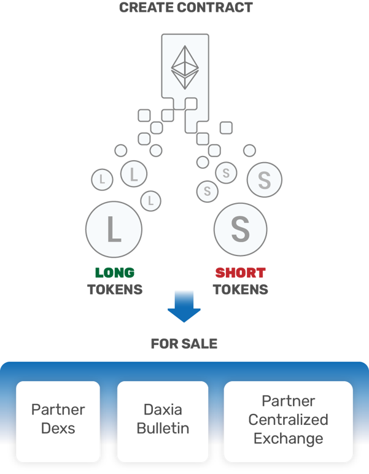

# Dynamic Rate Cash Transaction Tokens

Dynamic Rate Cash Transaction (DRCT) Tokens are standardized contracts for trading risk and hedging exposure to underlying reference rates. DRCT tokens provide more flexibility in terms of rate sensitivity and trading mechanisms than traditional OTC derivatives and allow for custom hedging and trading strategies not provided by traditional investments in cryptocurrency without minumum thresholds and with no intermediaries.

DRCT contracts start with a "creator" and are given a rate/duration/start date combination. Ether is locked as collateral in the smart contract by the creator. 

Short and Long Tokens are issued to the creator and represent the payouts of the contract. 

These tokens can be posted for sale on the Daxia Bulletin or with partner exchanges. 

All DRCT tokens ascribe to ERC20 specifications and can trade on any centralized or decentralized exchange. 

Table of Contents

1. [Instructions for quick start with Truffle Deployment](#Quick-Deployment)
2. [Documentation](#Documentation)
    * [Contracts Description](#Contracts-Description)
    * [Scripts Description](#Scripts-Description)
    * [Operator Setup](#operator-setup)

3. [Overview](#overview)
    * [How Does it work?](#how-it-works)
    * [Example Usage Scenarios](#usage-scenarios)
    * [Conclusion](#Conclusion)
    * [Updates](#Updates)

### Instructions for quick start with Truffle Deployment   

Follow the steps below to launch the Factory, Oracle and dependency contracts using Truffle. 

Clone the repo, cd into it, and then:

    $ npm install

    $ truffle compile

    $ truffle migrate

    $ truffle exec /scripts/setup.js

    $ truffle exec /scripts/contract_setup.js

You're ready to create DRCT tokens and contracts!

#### How to Contribute  
Join our slack, shoot us an email or contact us: 

Any contributions are welcome!

## Documentation  

### Overview of Contracts for Dynamic Rate Cash Transaction Tokens

### Contracts Description 
 * MasterDeployer.sol - Kicks off the factory creation by calling the CloneFactory.sol to clone a specified factory and keep track of active factories.
 * Factory.sol - The factory contract is the base of the system.  It sets the standardized variables used in the swap contract and is called to create new swap contracts and create new DRCT tokens for the user. 
 * UserContract.sol - If the user is using DDA's DApp, the Factory will read in the variables entered here and variables available through the Factory contract to properly register the swap contract.
 * Wrapped_Ether.sol - Is called by the Factory to convert Ether into an ERC20 token to create the base token that used in the swap. 
 * Deployer.sol - Is called by the Factory to deploy the new swap by calling the TokenToTokenSwap.sol and the CloneFactory.sol(allows the cloning of a contract by specifying the address).
 * CloneFactory.sol-Is used by the Factory.sol via the MasterDeployer.sol to clone deployed factories by specifying their address and it is also used via the Deployer.sol to clone deployed swap contracts by specifying their address. 
 * TokenToTokenSwap.sol - Sets up the smart contract that allows trading one token for another at the specified future date, based upon the change in the underlying reference rate. It uses the TokenLibrary to read in the functions and variables used.
     * TokenLibrary.sol - Houses all the logic and fucntions used in TokenToTokenSwap.sol that are needed to implement a start, create and implement a token swap and pay out participants.
 * DRCT_Token.sol - Creates the short and long tokens for the contract at a 1:1 ratio. It uses the DRCTLibrary to read in the functions and variables used.
     * DRCTLibary.sol - Houses all the logic for the DRCT token including the basic tranfer, tranferFrom, approve, adding a swap to a token, and getter functions.
 * Oracle.sol - Provides the reference rates for the contract.  Our oracle contract uses daily UNIX timestamp values as keys for specific values.
 * Test_Oracle.sol - Allows the operator to store custom values for testing functionallity.
 * Exchange.sol - Facilitates the direct sale of DRCT Tokens by allowing the users to buy and place DRCT tokens up for sale at a specified price.  
 * Membership.sol - Allows users to become a member of the DDA Cooperative. 

### Scripts Description 

The Truffle Migrations.js and 2_further_deployments.js under the migrations folder and Migrate_2.js scripts can be used to migrate all DDA contracts to a test net or the mainnet via ‘truffle migrate’. Currently, Migrate_1.js is being developed to create the linkage between the factory and DRCTLibrary without truffle.
 * Migrate_1.js - This script is under construction. We are currently working on linking the DRCTLibrary.sol and Factory.sol manually via the Migrate_1.js script so that users don't have to use Truffle migrations for the linkage.  
 * Migrate_2.js - Can be ran immediately after 'truffle migrate' and it will deploy several contracts and sets up two factories along with their short and long token addresses for the date specified. It deploys:
   * Wrapped_Ether.sol 
   * Exchange.sol
   * Membership.sol
   * MasterDeployer.sol
   * Two factories: 1) BTC/USD with duration of 7 days and multiplier of 1 and 2) TTH/USD with duration of 7 days and multiplier of 5. 
   * Two oracle contracts (BTC/USD and ETH/USD).  
   * Long and short token addresses for the two factories for the date specified.

The admin, daily and monthly scripts help deploy portions of the initial migration, provide daily summaries, and help with maintenance. 

 * Admin_1_setup.js – Deploys several contracts: Wrapped_Ether, Exchange, Membership, MasterDeployer and Factory (after the factory and DRCTLibrary are linked by Truffle via the migrations folder with the script 2_further_deployments.js).
 * Admin_2_newfactory_new_oracle.js – Deploys a new factory based on the specified duration, multiplier, and swap fee and a new oracle based on the specified APIs. The deployed MasterDeployer.sol, Membership.sol, and Wrapped_Ether.sol contract addresses need to be provided.
 * Admin_3_removefactory.js – Allows the owner to remove a factory from the specified MasterDeployer (_master).  Removing deprecated factories helps save gas on scripts that run processes by looping through all the factories linked to the MasterDeployer.
 * Admin_4_newfactory_with_existing_oracle.js – Deploys a factory based on the specified parameters (duration, multiplier and swap fee) and sets the oracle to an already deployed oracle.
 * Admin_5_update_oracle_on_factory.js – Allows the owner to update an existing factory with an existing oracle in the event the factory’s oracle becomes deprecated (the API becomes unusable) and another oracle is already deployed. 
 * Admin_6_deploy_and_update_oracle.js – Allows the owner to deploy a new oracle and update an existing factory with that new oracle in the event the factory’s oracle becomes deprecated (the API becomes unusable) and another oracle is already deployed. 
 * Admin_7_contract_setup.js – Allows the owner to deploy DRCT tokens for given start date
 * Admin_8_new_swap_contract.js – Deploys a new swap contract.
 * Admin_9_funding_oracles.js – Funds the oracle contracts. DDA contracts currently use the Oraclize service to get Bitcoin and Ethereum prices. The oracle contracts have to be funded so these can pay the Oraclize fees.
 * Daily_1_OracleQuery_db.js – Submits the Oraclize queries to get USD prices for Bitcoin and Ethereum.
 * Daily_2_oracle_check_db.js – Displays the prices reported by the Oraclize queries.
 * Daily_3_forcepay.js – Pays out the swap to the current short and long token holders.
 * Daily_4_summary.js – Provides a summary for the day (number of current factories, expiring contracts, paid contracts, started contracts, created contracts, number of short token holders, long token holders, total holders). 
 * Monthly_1_withdrawFees.js – Allows the factory owner to withdraw fees collected by the factory contract. 
 

## Operator Setup   

Documentation is noted for acting as the operator (DDA's role) and also entering into contract (a user).  Specific contract details are laid out for ease of use regardless of dev environment. 

 If you wish to simply enter a contract without a deep dive into the underlying solidity, you can use our DApp at http://dapp.ddacoop.org/ and follow the instuctions in the "How To" pop up (metamask is required). 

***
For ease of use, an 'Everything' flat file has been created containing all contracts, libraries and interfaces in the DRCT_standard library. 

        https://github.com/DecentralizedDerivatives/DRCT_standard/flat_files/Everything.sol

## **Setting up the environment**
If one is accessing the contracts via the DApp or by way of an already deployed Factory contract, some of these steps will have been done for you. Skip to Step 9 if you are user, have wrapped ether, know the contract address and are ready to enter a contract.

**Step 1: Operator - Create the Oracle**

 Oracle Contracts provide the reference rates for the contract.  Our oracle contract uses daily UNIX timestamp values as keys for specific values.   

        create Oracle();

DDA will grab values for contract dates, however parties can also initiate the contract call (and must do so on private instances of the oracle). This function stores the daily value of the API in the Oracle.

        oracle.PushData();

   For testing, you can use the Test_Oracle which allows you to store custom values in the contract.  

        create Test_Oracle(); //as oracle hereafter if testing
        oracle.StoreDocument(1543881600, 1000);
        oracle.StoreDocument(1544486400,1200);

**Step 2: Operator - Create the Base Tokens**

A DRCT contract is structured as trading one token for another at some future date, based upon the change in the underlying reference rate.  We need to set the token we are trading (aka our base token). 

     create Wrapped_Ether();

**Step 3: Operator - Create Factory Contract**
     
The factory contract is the base of the system.  It holds the standardized variables and is called to create new contracts and create new DRCT tokens for the user.  

    create Factory();

**Step 4: Operator - Create Deployer and DRCT_Token**

Due to gas limits on the network, the Factory contract could not hold all functionality.  For this reason, the Deployer contract holds the task of deploying a new swap and is called by the factory contract.  The DRCT_token is used by the factory contract to create the DRCT tokens.

       create Deployer(factory.address);
       create DRCT_Token(factory.address);

**Step 5: Operator - Create UserContract**

For wrapped Ether contracts, when creating a contract, it is required to deploy a contract from the Factory, wrap your Ether,  enter specific details of the contract, and then transfer your wrapped Ether to the contract.  To reduce the number of execution steps, the user contract reduces this step to: deploy contract and then enter the specific details using the User Contract.  

    create UserContract();
    UserContract.setFactory(factory.address);

**Step 6: Operator - Set Factory Variables**
    
     factory.setVariables(1000000000000000,7,1); //token ratio, duration (days), multiplier (this is current DApp settings)
     factory.setBaseToken(base.address);
     factory.setUserContract(userContract.address);
     factory.setDeployer(deployer.address);
     factory.settokenDeployer(tokenDeployer.address);
     factory.setOracleAddress(oracle.address);

The token ratio's simplify the number of DRCT tokens per base token.  For wrapped Ether, one Ether gets you 1e18 tokens.  To simplify this, we create a token ratio of 1e15 which means that for every one Ether worth of wrapped Ether, the party gets 1000 DRCT tokens.  The duration is the number of days the contract lasts (from the start date onward).  The multiplier is the number by which the reference rate is multiplied by.  Note that this also limits the contract in terms of potential upside/downside.  A multiplier of 10 means that if the underlying rate moves by 5%, the contract pays out based on a 50% change in the reference rate.  Since contracts are capped at a 100% move in either direction, a multiplier of 10 will be capped at moves of 10%.  

**Step 7: Operator - Create DRCT Tokens**

The DRCT tokens are the ERC20 tokens that represent the specific shares in a contract.  Since the contracts are standardized at the factory level, the DRCT tokens are interchangeable within the same DRCT token address (it does not matter what specific contract the DRCT token maps to). The token contract is expanded from normal ERC20 tokens to track the number and address of holders for use by the operator when paying out the contracts. If you are the first party to do a contract on a given start date, you will need to create the DRCT tokens.

     factory.deployTokenContract( 1516492800, true) ; 
     factory.deployTokenContract( 1516492800, false) ;

**Step 8: Operator - Creating contracts**
    
     factory.deployContract();

**Step 9: Operator - Entering contracts**

**Note: this step could also be the user Step 1 to enter an existing contract**

Parties can now either enter the contract manually by going to the swap on their own, or they can use the userContract.  If a party enters manually, they will be required to transfer the base tokens to the contract before DRCT tokens can be issued.  The UserContract simplifies this process.  The variables one needs to enter are: the contract address from the previous step and the amount of baseTokens. The amount of base tokens entered is doubled to create the same amount of short and long tokens. 

    UserContract.Initiate(contractAddress, uint amount);  //e.g. ("0x4c40e94a0f53747a4323cadeba4c995327fdee3b","10000000000000000000")

Once entered, a party must enter the other side. The party creating the contract can take the tokens to the exchange and trade the unwanted tokens.

The users now have DRCT_tokens in the addresses specified for the long/short tokens in the Factory contract.  

**Tip: Exit not tokenized contracts**

If the contract is not tokenized, parties may exit the contract (assuming both approve or only one in) using the method:
      
      TokenToTokenSwap.Exit();

**Step 10: Operator - Contract completion**

   The swap must be manually paid out after the end date.  The contract loops through all token holders in the DRCT_token and then pays out the swap based upon who is holding the tokens.  Once the tokens are paid out, the parties can then cash out or redeem their wrapped Ether (or they are now holding the base Token). 

      TokentoTokenSwap.forcePay();

**Step 11: Operator - Redeem your wrapped Ether**

     WrappedEther.withdraw(amount);  //enter amount in wei

## Overview  

## Example Usage Scenarios 

## Conclusion 

## Useful Links   

#### If you have questions, ask us on Slack: https://deriveth.slack.com/

DAPP:  http://dapp.daxia.us/ 

Oracle Methodology can be found at: https://github.com/DecentralizedDerivatives/Public_Oracle

Metamask - www.metamask.io 

Truffle - http://truffleframework.com/

#### Copyright

DDA Inc. 2018