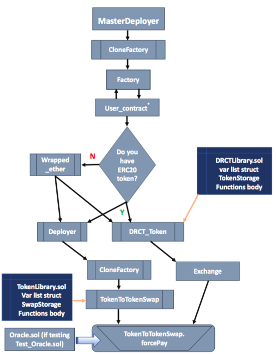
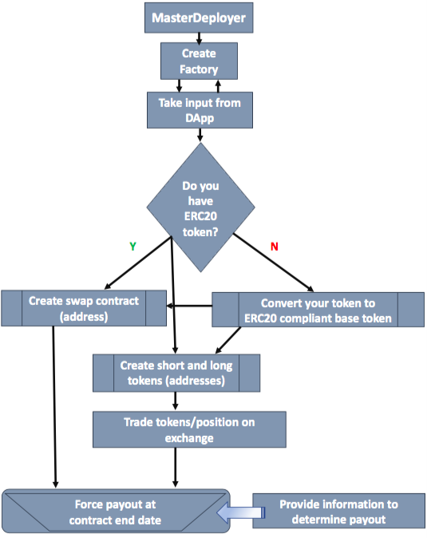

# Dynamic Rate Cash Transaction Tokens

Dynamic Rate Cash Transaction (DRCT) Tokens are standardized contracts for trading risk and hedging exposure to underlying reference rates.

## Useful Links

#### If you have questions, ask us on Slack: https://deriveth.slack.com/

DAPP:  https://drct.decentralizedderivatives.org 

Oracle Methodology can be found at: https://github.com/DecentralizedDerivatives/Public_Oracle

Metamask - www.metamask.io 

Truffle - http://truffleframework.com/

## How to Contribute
Join our slack, shoot us an email or contact us to list the tokens or the contract creation pieces on your site

Any contributions are welcome!

### Instructions for quick start with Truffle Deployment 

Follow the steps below to launch the Factory, Oracle and dependency contracts using truffle. 

Clone the repo, cd into it, and then:

    $ npm install

    $ truffle compile

    $ truffle migrate

    $ truffle exec /scripts/setup.js

    $ truffle exec /scripts/contract_setup.js

You're ready to create DRCT tokens and contracts!

### Overview of Contracts for Dynamic Rate Cash Transaction Tokens

**Contracts Process Flow**

**General Process Flow**

**Contracts Description**
 * Factory.sol - The factory contract is the base of the system.  It holds the standardized variables and is called to create new swap contracts and create new DRCT tokens for the user. 
 * UserContract.sol - If the user is using DDA's DApp, the Factory will read in the variables entered here.
 * Wrapped_Ether.sol - Is called by the Factory to convert Ether into an ERC20 token to create the base token. 
 * TokenDeployer.sol - Is called by the factory to deploy the new swap by calling the TokenToTokenSwap.sol.
 * TokenToTokenSwap.sol - Sets up the smart contract that allows trading one token for another at the specified future date, based upon the change in the underlying reference rate. It uses the TokenLibrary to read in the functions and variables used.
 * DRCT_Token.sol - Creates the short and long tokens for the contract at a 1:1 ratio. It uses the DRCTLibrary to read in the functions and variables used.
 * Oracle.sol Contracts provide the reference rates for the contract.  Our oracle contract uses daily UNIX timestamp values as keys for specific values.
 * Test_Oracle.sol allows the operator to store custom values for testing functionallity.    

## Documentation##

Documentation is noted for acting as the operator (DDA's role) and also entering into contract (a user).  Specific contract details are laid out for ease of use regardless of dev environment. 

 If you wish to simply enter a contract without a deep dive into the underlying solidity, you can use our DApp at drct.decentralizedderivatives.org and follow our video tutorial here: [https://www.youtube.com/watch?v=NdBqfzAeHFg](https://www.youtube.com/watch?v=NdBqfzAeHFg)

***
For ease of use, an 'everything' flat file has been created containing all contracts in the DRCT_standard library. 

        https://github.com/DecentralizedDerivatives/DRCT_standard/everything.sol

## **Setting up the environment**
If one is accessing the contracts via the DApp or by way of an already deployed Factory contract, these steps will have been done for you. Skip to Step 9 if you are user, have wrepped ether, know the contract address and are ready to enter a contract.

**Operator Step 1**
**Create the Oracle**

 Oracle Contracts provide the reference rates for the contract.  Our oracle contract uses daily UNIX timestamp values as keys for specific values.   

        create Oracle();

DDA will grab values for contract dates, however parties can also initiate the contract call(and must do so on private instances of the oracle). This function stores the daily value of the API in the Oracle.

        oracle.PushData();

   For testing, you can use the Test_Oracle which allows you to store custom values in the contract.  

        create Test_Oracle(); //as oracle hereafter if testing
        oracle.StoreDocument(1543881600, 1000);
        oracle.StoreDocument(1544486400,1200);

**Operator Step 2**
**Create the Base Tokens**

A DRCT contract is structured as trading one token for another at some future date, based upon the change in the underlying reference rate.  We need to set the token we are trading (aka our base token). 

     create Wrapped_Ether();

**Operator Step 3**
**Create Factory Contract**
     
The factory contract is the base of the system.  It holds the standardized variables and is called to create new contracts and create new DRCT tokens for the user.  

    create Factory();

**Operator Step 4**
**Create Deployer and DRCT_Token**

Due to gas limits on the network, the Factory contract could not hold all functionality.  For this reason, the Deployer contract holds the task of deploying a new swap and is called by the factory contract.  The DRCT_token is used by the factory contract to create the DRCT tokens.

       create Deployer(factory.address);
       create DRCT_Token(factory.address);

**Operator Step 5**
**Create UserContract**

For wrapped Ether contracts, when creating a contract, it is required to deploy a contract from the Factory, wrap your Ether,  enter specific details of the contract, and then transfer your wrapped Ether to the contract.  To reduce the number of execution steps, the user contract reduces this step to: deploy contract and then enter the specific details using the User Contract.  

    create UserContract();
    UserContract.setFactory(factory.address);

**Operator Step 6**
**Set Factory Variables**
    
     factory.setVariables(1000000000000000,7,1); //token ratio, duration (days), multiplier (this is current DApp settings)
     factory.setBaseToken(address _token);
     factory.setUserContract(userContract.address);
     factory.setDeployer(deployer.address);
     factory.settokenDeployer(tokenDeployer.address);
     factory.setOracleAddress(oracle.address);

The token ratio's simplify the number of DRCT tokens per base token.  For wrapped Ether, one Ether gets you 1e18 tokens.  To simplify this, we create a token ratio of 1e15 which means that for every one Ether worth of wrapped Ether, the party gets 1000 DRCT tokens.  The duration is the number of days the contract lasts (from the start date onward).  The multiplier is the number by which the reference rate is multiplied by.  Note that this also limits the contract in terms of potential upside/downside.  A multiplier of 10 means that if the underlying rate moves by 5%, the contract pays out based on a 50% change in the reference rate.  Since contracts are capped at a 100% move in either direction, a multiplier of 10 will be capped at moves of 10%.  

**Operator Step 7**
**Create DRCT Tokens**

The DRCT tokens are the ERC20 tokens that represent the specific shares in a contract.  Since the contracts are standardized at the factory level, the DRCT tokens are interchangeable within the same DRCT token address (it does not matter what specific contract the DRCT token maps to). The token contract is expanded from normal ERC20 tokens to track the number and address of holders for use by the operator when paying out the contracts. If you are the first party to do a contract on a given start date, you will need to create the DRCT tokens.

     factory.deployTokenContract( 1516492800, true) ; 
     factory.deployTokenContract( 1516492800, false) ;

**Operator Step 8**
**Creating contracts**
    
     factory.deployContract();

**Operator Step 9**
**Entering contracts**

**Note this could also be the user Step 1 to enter an existing contract**

Parties can now either enter the contract manually by going to the swap on their own, or they can use the userContract.  If a party enters manually, they will be required to transfer the base tokens to the contract before DRCT tokens can be issued.  The UserContract simplifies this process.  The variables one needs to enter are: the contract address from the previous step and the amount of baseTokens. The amount of base tokens entered is doubled to create the same amount of short and long tokens. 

    UserContract.Initiate(contractAddress, uint amount);  //eg ("0x4c40e94a0f53747a4323cadeba4c995327fdee3b","10000000000000000000")

Once entered, a party must enter the other side. The party creating the contract can take the tokens to the exchange and trade the unwanted tokens.

The users now have DRCT_tokens in the addresses specified for the long/short tokens in the Factory contract.  

**Exit not tokenized contracts**

If the contract is not tokenized, parties may exit the contract (assuming both approve or only one in) using the method:
      
      TokenToTokenSwap.Exit();

**Operator Step 10**
**Contract completion**

   The swap must be manually paid out after the end date.  The contract loops through all token holders in the DRCT_token and then pays out the swap based upon who is holding the tokens.  Once the tokens are paid out, the parties can then cash out or redeem their wrapped Ether (or they are now holding the base Token). 

      TokentoTokenSwap.forcePay();

**Operator step 11**
**Redeem your wrapped Ether**

     WrappedEther.withdraw(amount);  //enter amount in wei
