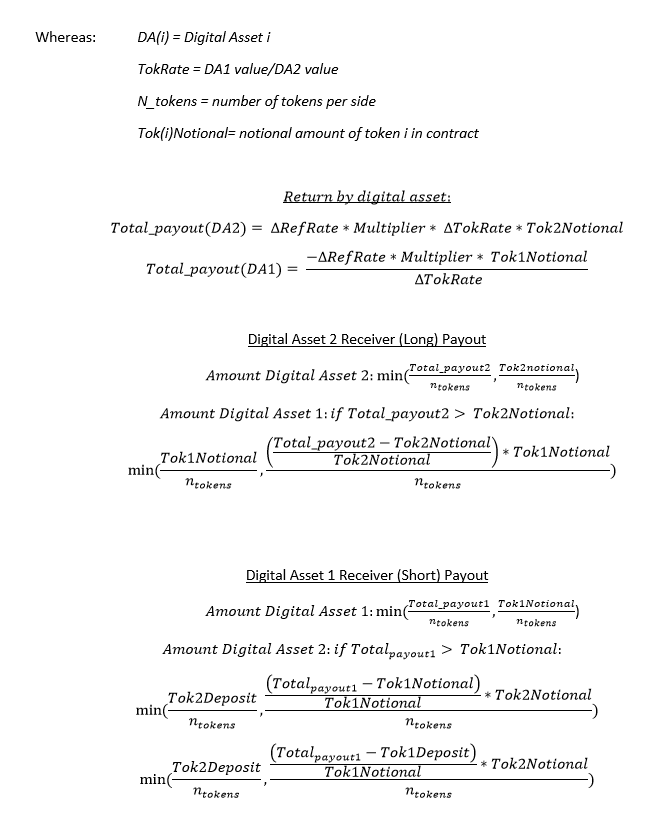

# Dynamic Rate Cash Transaction Tokens

Dynamic Rate Cash Transaction (DRCT) Tokens are standardized contracts for trading risk and hedging exposure to underlying reference rates. DRCT token contracts are a risk management tool for cryptocurrency users that allow to long and/or short cryptocurrencies. Being long is a position where, if the price goes up, you make money and if it goes down, you lose money. The traditional way of being long an asset would be to simply own it. Being short is a position where if the price goes down you make money and if it goes up you lose money. If you own an asset and short it, your held asset loses value but your short position makes you money, helping you mitigate the price volatility risk. 

DRCT contracts can provide more flexibility in terms of rate sensitivity and trading mechanisms than traditional OTC derivatives and allow for custom hedging and trading strategies not provided by traditional investments in cryptocurrency without minimum thresholds and with no intermediaries.

Additionally, DRCT tokens allow users to long or short assets that are non-native to Ethereum (like Bitcoin, Monero, Stellar, etc...) with Ether or any other ERC20 token.  

<details><summary>Table of Contents</summary>

1. [Instructions for quick start with Truffle Deployment](#Quick-Deployment)

2. [Overview](#overview)
    * [How Does it work?](#how-it-works)
    * [Example Usage Scenarios](#usage-scenarios)
    * [Conclusion](#Conclusion)
    * [Updates](#Updates)

3. [Documentation](#Documentation)
    * [Contracts Description](#Contracts-Description)
    * [Scripts Description](#Scripts-Description)
    * [Operator Setup](#operator-setup)
</details>

 

DRCT contracts start with a "creator" and are given a rate/duration/start date combination. Ether is locked as collateral in the smart contract by the creator.  Short and Long Tokens are issued to the creator and represent the payouts of the contract. These tokens can be posted for sale on the Daxia Bulletin or with partner exchanges. On the end date of the contract, the tokens are paid out from the collateral (to whoever is holding them at that point in time) based on the change in the underlying rate. 

All DRCT tokens ascribe to ERC20 specifications and can trade on any centralized or decentralized exchange. 


### Instructions for quick start with Truffle Deployment <a name="Quick-Deployment"> </a>  

Follow the steps below to launch the Factory, Oracle and dependency contracts using Truffle. 

Clone the repo, cd into it, and then:

    $ npm install

    $ truffle compile

    $ truffle migrate

    $ truffle exec /scripts/Admin_01_setup.js

    $ truffle exec /scripts/Admin_02_newfactory_new_oracle.js

    $ truffle exec /scripts/Admin_07_contract_setup.js

You're ready to create DRCT tokens and contracts!

#### How to Contribute<a name="how2contribute"> </a>  
Join our slack, shoot us an email or contact us: [](https://deriveth.slack.com/)
[](https://t.me/daxiachat)
[](https://discordapp.com/invite/xtsdpbS)


Any contributions are welcome!


## Overview <a name="overview"> </a> 
True adoption of cryptocurrencies will only occur when price volatility can be harnessed. Derivatives are products that say I’ll give you X in the future based on the change in Y. They can allow users to device risk mitigation strategies for highly volatile assets.

A functioning risk transfer market is the backbone of an advanced market economy. Whether it’s businesses needing to hedge currency risk or parties seeking exposure to a certain asset, a derivatives market is imperative for longer term planning and risk mitigation for a financial system. 

DRCT contracts provide a decentralized option (pun intended) for derivatives that bear no counterparty risk (fully collateralized), are not exchange specific (it produces ERC20 compliant tokens that can be traded on a centralized or decentralized exchange) and bring efficiency to the traditional system. Currently, if two parties want to hedge or transfer risk, that seemingly simple transaction looks like this:


The DRCT contracts allow for this new and more efficient model:


### How Does it work? <a name="how-it-works"> </a> 

If you wish to simply enter a contract without a deep dive into the underlying solidity, you can use our DApp at http://dapp.daxia.org/ and follow the instructions in the "How To" section (metamask is required).

Let's dive in:

DRCT contracts allow for a swap of two tokens based on the change in an underlying reference rate, technically forward contracts. By using token abstraction techniques from protocols such as 0x, the underlying tokens can trade as pure leveraged directional tokens.

But before users can create DRCT contracts, the operator, Daxia, has to deploy the factory dud. The factory dud is deployed once and subsequent factories are cloned from it to minimize costs (for more information on cloning contracts see our article <a href= https://blog.goodaudience.com/attack-of-the-clones-how-dda-contracts-are-so-cheap-to-deploy-f3cee9c7566>Attack Of The Clones — How DDA Contracts Are So Cheap To Deploy</a>). Once the factory dud is deployed the operator can deploy a factory and set the standardized variables (token ratio, time duration in days, and multiplier) for the factory. The factory contract is the base of the system.  It holds the standardized variables and is called to create new contracts and create new DRCT tokens for the users. The source for the underlying reference rate is also specified at the factory level and all contracts and tokens created from it will be tied to that source. 

Ethereum smart contracts cannot access off-chain data. If a smart contract relies on off-chain (e.g. internet) data to evaluate or execute a function, as the DRCT contracts do, the operator either has to manually feed the data to the contract, incentivize users to do it, or rely on a centralized party to provide the data (Oraclize.it is generally the standard). Currently, DRCT contracts use Oraclize.it to get off-chain data. The operator will have to deploy an oracle specifying the source and set the oracle address for the factory. Daxia specifies two API's for Oraclize.it to get reference rate data from, Gdax and Binance. If the Gdax API is unavailable/fails, the oracle will alternate between Gdax and Binance every 60 minutes until the underlying reference rate is obtained. We recognize the risk of the oracle or API's failing and we are mitigating that risk by having a backup API. However, Daxia is exploring other options and has developed a decentralized and more robust oracle, <a href= https://github.com/DecentralizedDerivatives/MineableOracle> Proof of Work Oracle(POWO)</a> that would be governed through a DAO. 

The Oracle contract specified APIs' are the pieces of information that allow DRCT users' to long or short assets that are non-native to Ethereum (like Bitcoin, Monero, Stellar, etc...) with Ether or any other ERC20 token. 

The standardized variables:
* Ratio -- The token ratio's simplify the number of DRCT tokens per base token. Currently our base token is designed to be ERC20 compliant. Ether has to be "wrapped" because it is not ERC20 compliant. One Ether gets you 1e18 wrapped Ether(ERC20 compliant) tokens.  To simplify this, we create a token ratio of 1e15 which means that for every one Ether worth of wrapped Ether, the party gets 1000 DRCT tokens. In the factory.setVariables function the token ratio specifies the denominator. The numerator is 1e18 since the wrapped Ether is ERC20 compliant. However, this token ratio could be customized if different ERC20 tokens are used to collateralize the short and long side.

```Solidity
factory.setVariables(1000000000000000,7,1,0); //token ratio, duration (days), multiplier, swapFee
```

<p align="center">

<br>

</p>

* Duration -- The duration is the number of days the contract lasts (from the start date onward).

* Multiplier -- The multiplier is the number by which the reference rate is multiplied by to determine the payout.  Note that this also limits the contract in terms of potential upside/downside because the contracts pay up to only the collateralized amount. A multiplier of 10 means that if the underlying rate moves by 5%, the contract pays out based on a 50% (10 X 5%) change in the reference rate.  Since contracts are capped at a 100% move in either direction, a multiplier of 10 will be capped at moves of 10%.

<p align="center">

</p>

* Underlying reference rate oracle -- In the traditional system, this has been a source of contention that has led to years of litigation over the "reference rate" source or valuation before settlement a derivative product. Being open about and agreeing on the source beforehand is another great efficiency introduced by DRCT contracts.  

Once the factory is deployed, the operator can create new tokens via the factory.deployTokenContract function and users can create and collateralize contracts, receive DRCT tokens in the addresses specified for the long and short tokens in the Factory contract and can sell the unwanted tokens/position through the bulletin or any exchange. All DRCT tokens ascribe to ERC20 specifications and can trade on any centralized or decentralized exchange. 

### Information necessary to trade:

Unlike most Ethereum tokens, these tokens have an expiration date. Upon the call/end date of the master contract (the creator DRCT contract), all trading in the token is suspended. The DRCT tokens are then delivered the token specified by the contract. This delivery gas cost is paid for by Daxia and requires zero input from the user. Daxia begins requesting the prices from the oracle at 12:15AM UTC time to determine the payouts and delivers the token payouts after successful callback (receiving the price) from the oracle. However, the oracle function (oracle.pushData()) and the delivery functions (TokenToToken.ForcePay(numtopay)) can be ran by any user as soon as the expiration date/end date is reached. The payout function will deliver the tokens/payout only after a price has been received for the end date.  

If a party wishes to maintain exposure to the underlying reference rate, they must enter into another contract with a further delivery date.

### Risk Profiles

With the 0x protocol and the liquidity at most exchanges, the token currency risk can be abstracted from the return of the underlying reference rate. If the underlying tokens have liquidity issues, there could be concerns about delivery of those tokens and the DRCT token may depreciate as delivery approaches. The underlying tokens could be any ERC20 token and DA1 and DA2 could be two different tokens, hence the TokRate below captures that. Since currently the DApp only allows for Ether/Wrapped Ether to be used as collateral the TokRate = 1. However, through the smart contracts, it would be possible to use any ERC20 token. Daxia's DApp is setup to take Ether right now, but we are exploring and developing infrastructure to allow for the use of DAI in our contracts and through the DApp. 

 

To assure that the token payouts don’t cap out due to an underlying move in the token rate, parties should use tokens with a stable rate or underlying token pairs with very tight arbitrage. 

## Example Usage Scenarios <a name="usage-scenarios"> </a>

An efficient derivatives market can provide a stable coin, cross border/chain hedge and risk exposure and act as a prediction market. 

#### Stable Coins
If you hold ETH and are shorting ETH, and this combined position is a token, you have a stable coin. It’s as simple as that. The only downfall is: what is the cost? Daxia’s products have full collateralization, a sometimes-costly endeavor, and require contracts to be rolled from one expiration to another. A tokenized short position in an ETH/USD Daxia contract can act as a transparent and easy-to-understand stable coin.

#### Prediction Markets
A prediction market is in many ways another word for a derivatives exchange mixed with a gambling website. The underlying products are almost always derivatives; the only difference is that the reference rate can be on politics, or sports, or another non-price at which point the nomenclature ‘prediction market’ slides easier off the tongue than casino. At their core, they are solving the same problems as derivatives markets and a functioning, truly custom derivatives product can incorporate all the functionality of a prediction market without the unnecessary regulatory sidestepping.

#### Cross Border/ Chain risk
A burgeoning technology is that of cross chain transfers. The system will rise to a whole new level when these abilities are seamless, borderless and trustless; however, for the meantime, cross chain transfer of risk will serve a large portion of the end users’ needs. Whether a party on the Ethereum wants Bitcoin exposure without the transaction fees and centralization of the exchanges, or a party desires to hedge price risk on an exchange in a jurisdiction which they are not approved to do business; derivatives allow parties to hedge risk or gain exposure in the native token of Ethereum. Having this ability will not only create incentives for openness across borders but will also allow for speculators to move exposure to a chain with simpler and more liquid decentralized exchanges.

## Conclusion <a name="conclusion"> </a>

Wide adoption of cryptocurrencies will only occur when price volatility can be harnessed and/or tamed. Businesses and individuals need derivatives to be part of their risk mitigation strategy. They should be focused on their business operations and daily life, not price volatility. 

The launching of bitcoin futures (or other crypto futures) and the push towards a regulated market will provide liquidity for the network, however does not address the fundamental need for the network which is a truly open, portable and unstoppable application available to all users. Businesses and individuals should not have to come up with a minimum of 5 Bitcoin to be able to short it. Wide adoption starts with trully accessable risk manangment tools for everyone. 

## Documentation <a name="Documentation"> </a> 

### Contracts Description <a name="Contracts-Description"> </a>
 * MasterDeployer.sol - Kicks off the factory creation by calling the CloneFactory.sol to clone a specified factory and keep track of active factories.
 * Factory.sol - The factory contract is the base of the system.  It sets the standardized variables used in the swap contract and is called to create new swap contracts and create new DRCT tokens for the user. 
 * UserContract.sol - If the user is using Daxia's DApp, the Factory will read in the variables entered here and variables available through the Factory contract to properly register the swap contract.
 * Wrapped_Ether.sol - Is called by the Factory to convert Ether into an ERC20 token to create the base token that used in the swap. 
 * Deployer.sol - Is called by the Factory to deploy the new swap by calling the TokenToTokenSwap.sol and the CloneFactory.sol(allows the cloning of a contract by specifying the address).
 * CloneFactory.sol-Is used by the Factory.sol via the MasterDeployer.sol to clone deployed factories by specifying their address and it is also used via the Deployer.sol to clone deployed swap contracts by specifying their address. 
 * TokenToTokenSwap.sol - Sets up the smart contract that allows trading one token for another at the specified future date, based upon the change in the underlying reference rate. It uses the TokenLibrary to read in the functions and variables used.
     * TokenLibrary.sol - Houses all the logic and fucntions used in TokenToTokenSwap.sol that are needed to implement a start, create and implement a token swap and pay out participants.
 * DRCT_Token.sol - Creates the short and long tokens for the contract at a 1:1 ratio. It uses the DRCTLibrary to read in the functions and variables used.
     * DRCTLibary.sol - Houses all the logic for the DRCT token including the basic tranfer, tranferFrom, approve, adding a swap to a token, and getter functions.
 * Oracle.sol - Provides the reference rates for the contract.  Our oracle contract uses daily UNIX timestamp values as keys for specific values.
 * Test_Oracle.sol - Allows the operator to store custom values for testing functionallity.
 * Exchange.sol - Facilitates the direct sale of DRCT Tokens by allowing the users to buy and place DRCT tokens up for sale at a specified price.  
 * Membership.sol - Allows users to become a member of the Daxia Cooperative. 

### Scripts Description <a name="Scripts-Description"> </a>

The Truffle Migrations.js and 2_further_deployments.js under the migrations folder and Migrate_2.js scripts can be used to migrate all Daxia contracts to a test net or the mainnet via ‘truffle migrate’. Currently, Migrate_1.js is being developed to create the linkage between the factory and DRCTLibrary without truffle.
 * Migrate_1.js - This script is under construction. We are currently working on linking the DRCTLibrary.sol and Factory.sol manually via the Migrate_1.js script so that users don't have to use Truffle migrations for the linkage.  
 * Migrate_2.js - Can be ran immediately after 'truffle migrate' and it will deploy several contracts and sets up two factories along with their short and long token addresses for the date specified. It deploys:
   * Wrapped_Ether.sol 
   * Exchange.sol
   * Membership.sol
   * MasterDeployer.sol
   * Two factories: 1) BTC/USD with duration of 7 days and multiplier of 1 and 2) TTH/USD with duration of 7 days and multiplier of 5. 
   * Two oracle contracts (BTC/USD and ETH/USD).  
   * Long and short token addresses for the two factories for the date specified.

The admin, daily and monthly scripts help deploy portions of the initial migration, provide daily summaries, and help with maintenance. 

 * Admin_1_setup.js – Deploys several contracts: Wrapped_Ether, Exchange, Membership, MasterDeployer and Factory (after the factory and DRCTLibrary are linked by Truffle via the migrations folder with the script 2_further_deployments.js).
 * Admin_2_newfactory_new_oracle.js – Deploys a new factory based on the specified duration, multiplier, and swap fee and a new oracle based on the specified APIs. The deployed MasterDeployer.sol, Membership.sol, and Wrapped_Ether.sol contract addresses need to be provided.
 * Admin_3_removefactory.js – Allows the owner to remove a factory from the specified MasterDeployer (_master).  Removing deprecated factories helps save gas on scripts that run processes by looping through all the factories linked to the MasterDeployer.
 * Admin_4_newfactory_with_existing_oracle.js – Deploys a factory based on the specified parameters (duration, multiplier and swap fee) and sets the oracle to an already deployed oracle.
 * Admin_5_update_oracle_on_factory.js – Allows the owner to update an existing factory with an existing oracle in the event the factory’s oracle becomes deprecated (the API becomes unusable) and another oracle is already deployed. 
 * Admin_6_deploy_and_update_oracle.js – Allows the owner to deploy a new oracle and update an existing factory with that new oracle in the event the factory’s oracle becomes deprecated (the API becomes unusable) and another oracle is already deployed. 
 * Admin_7_contract_setup.js – Allows the owner to deploy DRCT tokens for given start date
 * Admin_8_new_swap_contract.js – Deploys a new swap contract.
 * Admin_9_funding_oracles.js – Funds the oracle contracts. Daxia contracts currently use the Oraclize service to get Bitcoin and Ethereum prices. The oracle contracts have to be funded so these can pay the Oraclize fees.
 * Daily_1_OracleQuery_db.js – Submits the Oraclize queries to get USD prices for Bitcoin and Ethereum.
 * Daily_2_oracle_check_db.js – Displays the prices reported by the Oraclize queries.
 * Daily_3_forcepay.js – Pays out the swap to the current short and long token holders.
 * Daily_4_summary.js – Provides a summary for the day (number of current factories, expiring contracts, paid contracts, started contracts, created contracts, number of short token holders, long token holders, total holders). 
 * Monthly_1_withdrawFees.js – Allows the factory owner to withdraw fees collected by the factory contract. 
 

## Operator Setup <a name="operator-setup"> </a>  

The documentation below is noted for acting as the operator (Daxia's role) and also entering into contract (a user).  Specific contract details are laid out for ease of use regardless of dev environment. 

 If you wish to simply enter a contract without a deep dive into the underlying solidity, you can use our DApp at http://dapp.daxia.org/ and follow the instuctions in the "How To" section (metamask is required). 

***
For ease of use, an 'Everything' flat file has been created containing all contracts, libraries and interfaces in the DRCT_standard library. 

        https://github.com/DecentralizedDerivatives/DRCT_standard/flat_files/Everything.sol


## **Setting up the environment**
If one is accessing the contracts via the DApp or by way of an already deployed Factory contract, some of these steps will have been done for you. Skip to Step 9 if you are user, have wrapped ether, know the contract address and are ready to enter a contract.

**Step 1: Operator - Create the Oracle**

 Oracle Contracts provide the reference rates for the contract.  Our oracle contract uses daily UNIX timestamp values as keys for specific values.   

        create Oracle("json(https://api.gdax.com/products/BTC-USD/ticker).price", "json(https://api.binance.com/api/v3/ticker/price?symbol=BTCUSDT).price"); //oracle_api, oracle_api2

Daxia will grab values for contract dates, however parties can also initiate the contract call (and must do so on private instances of the oracle). This function stores the daily value of the API in the Oracle.

        oracle.PushData();

   For testing, you can use the Test_Oracle which allows you to store custom values in the contract.  

        create Test_Oracle(); //as oracle hereafter if testing
        oracle.StoreDocument(1543881600, 1000);
        oracle.StoreDocument(1544486400,1200);

**Step 2: Operator - Create the Base Tokens**

A DRCT contract is structured as trading one token for another at some future date, based upon the change in the underlying reference rate.  We need to set the token we are trading (aka our base token). 

     create Wrapped_Ether();


**Step 3: Operator - Create Factory Contract**
     
The factory contract is the base of the system.  It holds the standardized variables and is called to create new contracts and create new DRCT tokens for the user.  

    create Factory(0);//the constructor argument includes _memberTypes. Enter "0".

**Step 4: Operator - Create Deployer and DRCT_Token**

Due to gas limits on the network, the Factory contract could not hold all functionality.  For this reason, the Deployer contract holds the task of deploying a new swap and is called by the factory contract.  The DRCT_token is used by the factory contract to create the DRCT tokens.

       create Deployer(factory.address);
       create DRCT_Token(factory.address);

**Step 5: Operator - Create UserContract**

For wrapped Ether contracts, when creating a contract, it is required to deploy a contract from the Factory, wrap your Ether,  enter specific details of the contract, and then transfer your wrapped Ether to the contract.  To reduce the number of execution steps, the user contract reduces this step to: deploy contract and then enter the specific details using the User Contract.  

    create UserContract();
    UserContract.setFactory(factory.address);

**Step 6: Operator - Set Factory Variables**
    
     factory.setVariables(1000000000000000,7,1,0); //token ratio, duration (days), multiplier, swapFee
     factory.setBaseToken(base.address);
     factory.setUserContract(userContract.address);
     factory.setDeployer(deployer.address);
     factory.settokenDeployer(tokenDeployer.address);
     factory.setOracleAddress(oracle.address);

The token ratio's simplify the number of DRCT tokens per base token.  For wrapped Ether, one Ether gets you 1e18 tokens.  To simplify this, we create a token ratio of 1e15 which means that for every one Ether worth of wrapped Ether, the party gets 1000 DRCT tokens.  The duration is the number of days the contract lasts (from the start date onward).  The multiplier is the number by which the reference rate is multiplied by.  Note that this also limits the contract in terms of potential upside/downside.  A multiplier of 10 means that if the underlying rate moves by 5%, the contract pays out based on a 50% change in the reference rate.  Since contracts are capped at a 100% move in either direction, a multiplier of 10 will be capped at moves of 10%.  The swapFee allows the opearator to charge a fee when a contract is created by the user. 

**Step 7: Operator - Create DRCT Tokens**

The DRCT tokens are the ERC20 tokens that represent the specific shares in a contract.  Since the contracts are standardized at the factory level, the DRCT tokens are interchangeable within the same DRCT token address (it does not matter what specific contract the DRCT token maps to). The token contract is expanded from normal ERC20 tokens to track the number and address of holders for use by the operator when paying out the contracts. If you are the first party to do a contract on a given start date, you will need to create the DRCT tokens.

     factory.deployTokenContract( 1516492800); 
     factory.deployTokenContract( 1516492800);

**Step 8: Operator - Creating contracts**
    
     factory.deployContract();


**Step 9: Operator - Entering contracts**

**Note: this step could also be the user Step 1 to enter an existing contract**

Parties can now either enter the contract manually by going to the swap on their own, or they can use the userContract.  If a party enters manually, they will be required to transfer the base tokens to the contract before DRCT tokens can be issued.  The UserContract simplifies this process.  The variables one needs to enter are: the contract address from the previous step and the amount of baseTokens. The amount of base tokens entered is doubled to create the same amount of short and long tokens. 

    UserContract.Initiate(contractAddress, uint amount);  //e.g. ("0x4c40e94a0f53747a4323cadeba4c995327fdee3b","10000000000000000000")


Once entered, a party must enter the other side. The party creating the contract can take the tokens to the exchange and trade the unwanted tokens.

The users now have DRCT_tokens in the addresses specified for the long/short tokens in the Factory contract.  

**Tip: Exit not tokenized contracts**

If the contract is not tokenized, parties may exit the contract (assuming both approve or only one in) using the method:
      
      TokenToTokenSwap.Exit();

**Step 10: Operator - Contract completion**

   The swap must be manually paid out after the end date.  The contract loops through all token holders in the DRCT_token and then pays out the swap based upon who is holding the tokens.  Once the tokens are paid out, the parties can then cash out or redeem their wrapped Ether (or they are now holding the base Token). 

      TokentoTokenSwap.forcePay();

**Step 11: Operator - Redeem your wrapped Ether**

     WrappedEther.withdraw(amount);  //enter amount in wei


## Useful Links <a name="UsefulLinks"> </a>  

#### If you have questions, ask us on Slack: https://deriveth.slack.com/

DAPP:  http://dapp.daxia.us/ 

Oracle Methodology can be found at: https://github.com/DecentralizedDerivatives/Public_Oracle

Metamask - www.metamask.io 

Truffle - http://truffleframework.com/

#### Copyright

DDA Inc. 2018