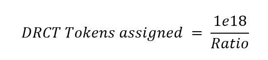
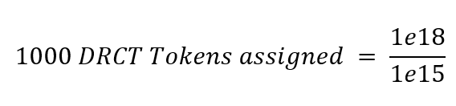
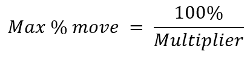

<p align="center">
  <a href='https://www.daxia.us/'>
    
  </a>
</p>

<p align="center">
  <a href='https://dapp.daxia.us/'>
    
  </a>
  <a href='https://deriveth.slack.com/'>
    
  </a>
  <a href='https://t.me/daxiachat'>
    
  </a>
  <a href='https://twitter.com/DaxiaOfficial'>
    
  </a> 
   
</p>

# Dynamic Rate Cash Transaction Tokens
Documentation to setup the DRCT standard as the operator.

## Table of Contents

* [Documentation](#Documentation)
   * [Operator Setup](#operator-setup)
      * [Setting up the environment](#environment)
      * [Step 1: Operator - Create the Oracle](#oracle) 
      * [Step 2: Operator - Create the Base contracts](#syscontracts)
      * [Step 3: Operator - Create Factory Contract](#factory)
      * [Step 4: Operator - Create Deployer](#deployer)
      * [Step 5: Operator - Create UserContract](#userContract)
      * [Step 6: Operator - Set Factory Variables](#factoryVars)
      * [Step 7: Operator - Create DRCT Tokens](#createTokens)
      * [Step 8: Operator - Creating contracts](#createContracts)
      * [Step 9: Operator - Entering contracts](#enterContract)
      * [Step 10: Operator - Contract completion](#ContractEnd)
      * [Step 11: Operator - Redeem your wrapped Ether](#operatorWETH)
      * [Step 11: User - Redeem your wrapped Ether](#userWETH)
   * [Testing](#testing)
   * [Contracts Description](#Contracts-Description)
   * [Scripts Description](#Scripts-Description)
* [Useful Links](#UsefulLinks)

<details><summary>Contributing information</summary>

   * [Maintainers](#Maintainers)
   * [How to Contribute](#how2contribute)
   * [Copyright](#copyright)
 </details>

## Documentation <a name="Documentation"> </a> 

There are four main contracts used to create DRCT contracts: the Factory.sol, TokenToTokenSwap.sol, Oracle.sol and the standard wrapped ether contract deployed by RadarRelay.

* Factory.sol - Allows users to create contracts (by setting the standardized variables as desired) and short and long tokens for the user. It uses several other contracts to minimize deployment costs and streamline the process for the user: DRCTLibrary.sol, UserContract.sol, MasterDeployer.sol, DRCT_Token.sol and CloneFactory.sol. 

* TokenToTokenSwap.sol - Sets up the smart contract that allows trading one token for another at the specified future date, based upon the change in the underlying reference rate. It uses the TokenLibrary.sol to store in the functions' logic and variables used. it  uses the Deployer.sol, CloneFactory and UserContract.sol to minimize costs and streamline the process for the user.

* Oracle.sol - The Oracle contract is set up to request a value form Oraclize.it and save only one value per day. At deployment two APIs' are specified (Gdax and Binance) for Oraclize to fetch the underlying rate. The API's are the pieces of information that allow DRCT users' to long or short assets that are non-native to Ethereum (like Bitcoin, Monero, Stellar, etc...) with Ether or any other ERC20 token. Daxia specifies two API's for Oraclize.it to get reference rate data from, Gdax and Binance. If the Gdax API is unavailable/fails, the oracle will alternate between Gdax and Binance every 60 minutes until the underlying reference rate is obtained. We recognize the risk of the oracle or API's failing and we are mitigating that risk by having a backup API. However, Daxia is exploring other options and has developed a decentralized and more robust oracle, <a href= https://github.com/DecentralizedDerivatives/MineableOracle> Proof of Work Oracle(POWO)</a>.

* WETH9.sol - is the standard used for wrapped ether in the space. WETH9 mainnet address is [0xC02aaA39b223FE8D0A0e5C4F27eAD9083C756Cc2](https://etherscan.io/address/0xc02aaa39b223fe8d0a0e5c4f27ead9083c756cc2)
and the code is verified on Etherscan.

## Operator Setup <a name="operator-setup"> </a>  

The documentation below is noted for acting as the operator (Daxia's role) and also entering into contract (a user).  Specific contract details are laid out for ease of use regardless of dev environment. 

 If you wish to simply enter a contract without a deep dive into the underlying solidity, you can use our DApp at http://dapp.daxia.org/ and follow the instructions in the "How To" section (metamask is required). 

***
For ease of use, an 'Everything' flat file has been created containing all contracts, libraries and interfaces in the DRCT_standard library. 

        https://github.com/DecentralizedDerivatives/DRCT_standard/flat_files/Everything.sol


## **Setting up the environment** <a name="environment"> </a> 
If one is accessing the contracts via the DApp or by way of an already deployed Factory contract, some of these steps will have been done for you. Skip to Step 9 if you are user, have wrapped ether, know the contract address and are ready to enter a contract.

Before jumping into step 1 below, you must compile your code and have your bytecode or json files ready for deployment. If you are using truffle, this will work for compiling:

    $ git clone https://github.com/DecentralizedDerivatives/DRCT_standard

    $ cd DRCT_standard

    $ npm install

    $ truffle compile


**Step 1: Operator - Create the Oracle** <a name="oracle"> </a> 

Oracle Contracts provide the reference rates for the contract. Daxia specifies two API's for Oraclize.it to get reference rate data from, Gdax and Binance. If the Gdax API is unavailable/fails, the oracle will alternate between Gdax and Binance every 60 minutes until the underlying reference rate is obtained. We recognize the risk of the oracle or API's failing and we are mitigating that risk by having a backup API. However, Daxia is exploring other options and has developed a decentralized and more robust oracle, <a href= https://github.com/DecentralizedDerivatives/MineableOracle> Proof of Work Oracle(POWO)</a>.

Our oracle contract uses daily UNIX timestamp values as keys for specific values.   

        create Oracle("json(https://api.gdax.com/products/BTC-USD/ticker).price", "json(https://api.binance.com/api/v3/ticker/price?symbol=BTCUSDT).price"); //oracle_api, oracle_api2

Daxia will grab values for contract dates, however parties can also initiate the contract call (and must do so on private instances of the oracle). This function stores the daily value of the API in the Oracle. Once a value is received it cannot be replaced.

        oracle.PushData();

   For testing, you can use the Test_Oracle which allows you to store custom values in the contract.  

        create Test_Oracle(); //as oracle hereafter if testing
        oracle.StoreDocument(1543881600, 1000);
        oracle.StoreDocument(1544486400,1200);

**Step 2: Operator - Create the Base contracts** <a name="syscontracts"> </a>

Before users can create DRCT contracts, the operator, Daxia, has to deploy the base contracts for the system, including the Exchange, Membership, MasterDeployer, DRCTLibrary and Factory which will serve as the "factory dud". The factory dud is deployed once and the MasterDeployer.SetFactory is set to the deployed Factory.sol address any subsequent factories are cloned from it to minimize costs (for more information on cloning contracts see our article <a href= https://blog.goodaudience.com/attack-of-the-clones-how-dda-contracts-are-so-cheap-to-deploy-f3cee9c7566>Attack Of The Clones — How DDA Contracts Are So Cheap To Deploy</a>). Once the factory dud is deployed the operator can deploy a factory(via the master depoyer-Step 3).

        create Exchange.new();
        create Membership.new(); 
        create MasterDeployer.new();
        create DRCTLIbrary.new();

Once you have the DRCTLibrary address, you will need to open up your compiled code for the Factory.sol and search for '\_\_DRCTLibrary_\_\_\_\_\_\_\_\_\_\_\_\_\_\_\_\_\_\_\_\_\_\_\_\_\__' and replace it with the DRCTLibrary address without the first two characters, meaning without the leading '0x'. This will link the Factory and the DRCTLibrary when you deploy the factory in the next step. If you use truffle ('migrate' command, as in the quick instructions) to test on the Rinkeby testnet, the migrate command will automatically link the factory and DRCTLibrary.

        create Factory.new(0); //this will be the factory dud
        masterDeployer.setFactory(factory.address);

A DRCT contract is structured as trading one token for another at some future date, based upon the change in the underlying reference rate.  We need to set the token we are trading (aka our base token). Daxia uses the standard Wrapped Ether contract deployed by Radar Relay.

WETH9 mainnet address is [0xC02aaA39b223FE8D0A0e5C4F27eAD9083C756Cc2](https://etherscan.io/address/0xc02aaa39b223fe8d0a0e5c4f27ead9083c756cc2)

For testing purposes you will need to deploy your own wrapped ether contract.

        create WETH9.new();


**Step 3: Operator - Create Factory Contract** <a name="factory"> </a>
     
The factory contract is the base of the system.  It holds the standardized variables (token ratio, time duration in days, and multiplier) for the factory. The factory contract is the base of the system.  It is called to create new contracts and create new DRCT tokens for the users. The source for the underlying reference rate(oracle.address) is also specified at the factory level and all contracts and tokens created from it will be tied to that source. 


    create masterDeployer.deployFactory(0);//the constructor argument includes _memberTypes. Enter "0".


**Step 4: Operator - Create Deployer** <a name="deployer"> </a>

Due to gas limits on the network, the Factory contract could not hold all functionality.  For this reason, the Deployer contract holds the task of deploying a new swap and is called by the factory contract.  

       create Deployer(factory.address);


**Step 5: Operator - Create UserContract** <a name="userContract"> </a>

For wrapped Ether contracts, when creating a contract, it is required to deploy a contract from the Factory, wrap your Ether,  enter specific details of the contract, and then transfer your wrapped Ether to the contract.  To reduce the number of execution steps, the user contract reduces this step to: deploy contract and then enter the specific details using the User Contract.  

    create UserContract();
    UserContract.setFactory(factory.address);

**Step 6: Operator - Set Factory Variables**  <a name="factoryVars"> </a>
    
     factory.setVariables(1000000000000000,7,1,0); //token ratio, duration (days), multiplier, swapFee
     factory.setBaseToken('0xC02aaA39b223FE8D0A0e5C4F27eAD9083C756Cc2'); //wrapped ether contract
     factory.setUserContract(userContract.address);
     factory.setDeployer(deployer.address);
     factory.setOracleAddress(oracle.address);
     factory.setMemberContract(membership.address);
     factory.setWhitelistedMemberTypes([0]);//Use '0' if not using membership or to allow all users

Factory variables:
* Ratio -- The token ratio's simplify the number of DRCT tokens per base token. Currently our base token is designed to be ERC20 compliant. Ether has to be "wrapped" because it is not ERC20 compliant. One Ether gets you 1e18 wrapped Ether(ERC20 compliant) tokens.  To simplify this, we create a token ratio of 1e15 which means that for every one Ether worth of wrapped Ether, the party gets 1000 DRCT tokens. In the factory.setVariables function the token ratio specifies the denominator. The numerator is 1e18 since the wrapped Ether is ERC20 compliant. However, this token ratio could be customized if different ERC20 tokens are used to collateralize the short and long side.

<p align="center">

<br>

</p>

* Duration -- The duration is the number of days the contract lasts (from the start date onward).

* Multiplier -- The multiplier is the number by which the reference rate is multiplied by to determine the payout.  Note that this also limits the contract in terms of potential upside/downside because the contracts pay up to only the collateralized amount. A multiplier of 10 means that if the underlying rate moves by 5%, the contract pays out based on a 50% (10 X 5%) change in the reference rate.  Since contracts are capped at a 100% move in either direction, a multiplier of 10 will be capped at moves of 10%.

<p align="center">

</p>

* SwapFee -- Allows the operator to specify a fee.  The swapFee allows the operator to charge a fee when a contract is created by the user. 

**Step 7: Operator - Create DRCT Tokens**  <a name="createTokens"> </a>

The DRCT tokens are the ERC20 tokens that represent the specific shares in a contract.  Since the contracts are standardized at the factory level, the DRCT tokens are interchangeable within the same DRCT token address (it does not matter what specific contract the DRCT token maps to). The token contract is expanded from normal ERC20 tokens to track the number and address of holders for use by the operator when paying out the contracts. If you are the first party to do a contract on a given start date, you will need to create the DRCT tokens.

The start date has to be provided in Unix time with hours, minutes and seconds set to all zeros. 

     factory.deployTokenContract( 1516492800); 


**Step 8: Operator - Creating contracts**  <a name="createContracts"> </a>
    
     factory.deployContract(uint _start_date,address _user); //e.g. (1516492800, '0x4c40e94a0f53747a4323cadeba000000000000')


**Step 9: Operator - Entering contracts**  <a name="enterContract"> </a>

**Note: this step could also be the user Step 1 to enter an existing contract**

Parties can now either enter the contract manually by going to the swap on their own, or they can use the userContract.  If a party enters manually, they will be required to transfer the base tokens to the contract before DRCT tokens can be issued.  The UserContract simplifies this process.  The variables one needs to enter are: the contract address from the previous step and the amount of baseTokens. The amount of base tokens entered is doubled to create the same amount of short and long tokens. 

    UserContract.Initiate(contractAddress, uint amount);  //e.g. ("0x4c40e94a0f53747a4323cadeba4c995327fdee3b","10000000000000000000")

The users now have DRCT_tokens(ERC20 compliant) in the addresses specified for the long/short tokens in the Factory contract.  The party creating the contract can take the tokens to the bulletin or any exchange and trade the unwanted tokens/position.

**Step 10: Operator - Contract completion**  <a name="ContractEnd"> </a>

The swap must be manually paid out after the end date.  The contract loops through all token holders in the DRCT_token and then pays out to whoever is holding the tokens on the end date.  Once the tokens are paid out, the parties can then cash out or redeem their wrapped Ether (or they are now holding the base Token). 

      TokentoTokenSwap.forcePay(uint _numtopay);//e.g. '20' 

The \_numtopay variable sets the number of swaps to pay while looping. You may have to loop a several times or set the \_numtopay to a larger number. 

The payout is capped by the collateral and the multiplier. The payout ratio logic for the TokentoTokenSwap.forcePay function is in the TokentoTokenSwap.Calculate function:

```Solidity
    /**
    *@dev This function calculates the payout of the swap. It can be called after the Swap has been tokenized.
    *The value of the underlying cannot reach zero, but rather can only get within 0.001 * the precision
    *of the Oracle.
    */
    function Calculate(SwapStorage storage self) internal{
        uint ratio;
        self.token_amount = self.token_amount.mul(10000-self.contract_details[6]).div(10000);
        if (self.contract_details[4] > 0 && self.contract_details[5] > 0)
            ratio = (self.contract_details[5]).mul(100000).div(self.contract_details[4]);
            if (ratio > 100000){
                ratio = (self.contract_details[2].mul(ratio - 100000)).add(100000);
            }
            else if (ratio < 100000){
                    ratio = SafeMath.min(100000,(self.contract_details[2].mul(100000-ratio)));
                    ratio = 100000 - ratio;
            }
        else if (self.contract_details[5] > 0)
            ratio = 10e10;
        else if (self.contract_details[4] > 0)
            ratio = 0;
        else
            ratio = 100000;
        ratio = SafeMath.min(200000,ratio);
        self.pay_to_long = (ratio.mul(self.token_amount)).div(self.num_DRCT_tokens).div(100000);
        self.pay_to_short = (SafeMath.sub(200000,ratio).mul(self.token_amount)).div(self.num_DRCT_tokens).div(100000);
    }
```


**Step 11: Operator - Redeem your wrapped Ether**  <a name="operatorWETH"> </a>

     Factory.withdrawFees();
     WrappedEther.withdraw(uint amount); //amount to withdraw

**Step 11: User - Redeem your wrapped Ether** <a name="userWETH"> </a>

     WrappedEther.withdraw(uint amount); //amount to withdraw  

### Testing <a name="testing"> </a>
To test using truffle run:

    $ truffle compile

    $ truffle develop

    $ migrate

    $ test

Truffle will automatically run all the test scripts under the test folder. 

### Contracts Description <a name="Contracts-Description"> </a>
 * MasterDeployer.sol - Kicks off the factory creation by calling the CloneFactory.sol to clone a specified factory and keep track of active factories.
 * Factory.sol - The factory contract is the base of the system.  It sets the standardized variables used in the swap contract and is called to create new swap contracts and create new DRCT tokens for the user. 
 * UserContract.sol - If the user is using Daxia's DApp, the Factory will read in the variables entered here and variables available through the Factory contract to properly register the swap contract.
 * WETH9.sol - Is called by the Factory to convert Ether into an ERC20 token to create the base token that used in the swap. 
 * Deployer.sol - Is called by the Factory to deploy the new swap by calling the TokenToTokenSwap.sol and the CloneFactory.sol(allows the cloning of a contract by specifying the address).
 * CloneFactory.sol-Is used by the Factory.sol via the MasterDeployer.sol to clone deployed factories by specifying their address and it is also used via the Deployer.sol to clone deployed swap contracts by specifying their address. 
 * TokenToTokenSwap.sol - Sets up the smart contract that allows trading one token for another at the specified future date, based upon the change in the underlying reference rate. It uses the TokenLibrary to read in the functions and variables used.
     * TokenLibrary.sol - Houses all the logic and fucntions used in TokenToTokenSwap.sol that are needed to implement a start, create and implement a token swap and pay out participants.
 * DRCT_Token.sol - Creates the short and long tokens for the contract at a 1:1 ratio. It uses the DRCTLibrary to read in the functions and variables used.
     * DRCTLibary.sol - Houses all the logic for the DRCT token including the basic tranfer, tranferFrom, approve, adding a swap to a token, and getter functions.
 * Oracle.sol - Provides the reference rates for the contract.  Our oracle contract uses daily UNIX timestamp values as keys for specific values.
 * Test_Oracle.sol - Allows the operator to store custom values for testing functionallity.
 * Exchange.sol - Facilitates the direct sale of DRCT Tokens by allowing the users to buy and place DRCT tokens up for sale at a specified price.  
 * Membership.sol - Allows users to become a member of the Daxia Cooperative. 

### Scripts Description <a name="Scripts-Description"> </a>

The Truffle Migrations.js and 2_further_deployments.js under the migrations folder and Migrate_2.js scripts can be used to migrate all Daxia contracts to a test net or the mainnet via ‘truffle migrate’. Currently, Migrate_1.js is being developed to create the linkage between the factory and DRCTLibrary without truffle.
 * Migrate_1.js - This script is under construction. We are currently working on linking the DRCTLibrary.sol and Factory.sol manually via the Migrate_1.js script so that users don't have to use Truffle migrations for the linkage.  
 * Migrate_2.js - Can be ran immediately after 'truffle migrate' and it will deploy several contracts and sets up two factories along with their short and long token addresses for the date specified. It deploys:
   * WETH9.sol 
   * Exchange.sol
   * Membership.sol
   * MasterDeployer.sol
   * Two factories: 1) BTC/USD with duration of 7 days and multiplier of 1 and 2) TTH/USD with duration of 7 days and multiplier of 5. 
   * Two oracle contracts (BTC/USD and ETH/USD).  
   * Long and short token addresses for the two factories for the date specified.

The admin, daily and monthly scripts help deploy portions of the initial migration, provide daily summaries, and help with maintenance. 

 * Admin_1_setup.js – Deploys several contracts: WETH9, Exchange, Membership, MasterDeployer and Factory (after the factory and DRCTLibrary are linked by Truffle via the migrations folder with the script 2_further_deployments.js).
 * Admin_2_newfactory_new_oracle.js – Deploys a new factory based on the specified duration, multiplier, and swap fee and a new oracle based on the specified APIs. The deployed MasterDeployer.sol, Membership.sol, and WETH9.sol contract addresses need to be provided.
 * Admin_3_removefactory.js – Allows the owner to remove a factory from the specified MasterDeployer (_master).  Removing deprecated factories helps save gas on scripts that run processes by looping through all the factories linked to the MasterDeployer.
 * Admin_4_newfactory_with_existing_oracle.js – Deploys a factory based on the specified parameters (duration, multiplier and swap fee) and sets the oracle to an already deployed oracle.
 * Admin_5_update_oracle_on_factory.js – Allows the owner to update an existing factory with an existing oracle in the event the factory’s oracle becomes deprecated (the API becomes unusable) and another oracle is already deployed. 
 * Admin_6_deploy_and_update_oracle.js – Allows the owner to deploy a new oracle and update an existing factory with that new oracle in the event the factory’s oracle becomes deprecated (the API becomes unusable) and another oracle is already deployed. 
 * Admin_7_contract_setup.js – Allows the owner to deploy DRCT tokens for given start date
 * Admin_8_new_swap_contract.js – Deploys a new swap contract.
 * Admin_9_funding_oracles.js – Funds the oracle contracts. Daxia contracts currently use the Oraclize service to get Bitcoin and Ethereum prices. The oracle contracts have to be funded so these can pay the Oraclize fees.
 * Daily_1_OracleQuery_db.js – Submits the Oraclize queries to get USD prices for Bitcoin and Ethereum.
 * Daily_2_oracle_check_db.js – Displays the prices reported by the Oraclize queries.
 * Daily_3_forcepay.js – Pays out the swap to the current short and long token holders.
 * Daily_4_summary.js – Provides a summary for the day (number of current factories, expiring contracts, paid contracts, started contracts, created contracts, number of short token holders, long token holders, total holders). 
 * Monthly_1_withdrawFees.js – Allows the factory owner to withdraw fees collected by the factory contract. 
 


## Useful Links <a name="UsefulLinks"> </a>  

If you have questions, ask us on Slack: https://deriveth.slack.com/

DAPP:  http://dapp.daxia.us/ 

Oracle Methodology can be found at: https://github.com/DecentralizedDerivatives/Public_Oracle

Metamask - www.metamask.io 

Truffle - http://truffleframework.com/

#### Maintainers <a name="maintainers"> </a> 
[@themandalore](https://github.com/themandalore)
<br>
[@brendaloya](https://github.com/brendaloya) 

#### How to Contribute<a name="how2contribute"> </a>  
Join our slack, shoot us an email or contact us: [](https://deriveth.slack.com/)
[](https://t.me/daxiachat)
[](https://discordapp.com/invite/xtsdpbS)

Any contributions are welcome!


#### Copyright <a name="copyright"> </a> 

DDA Inc. 2018